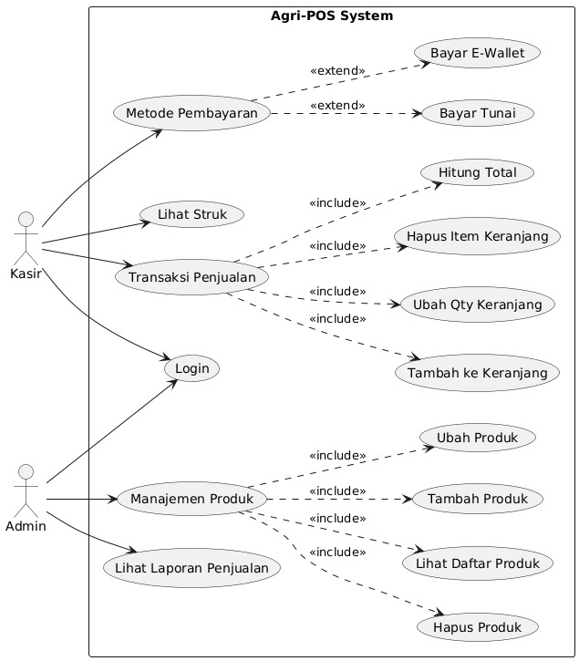
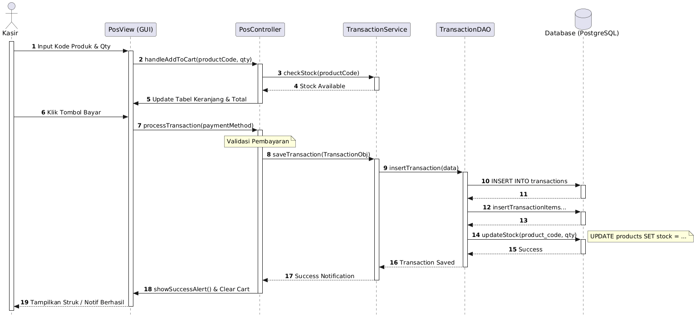
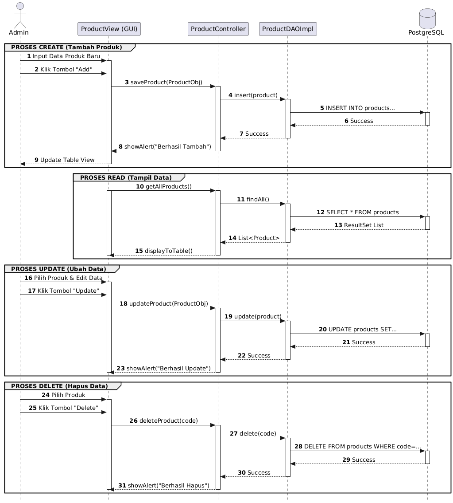
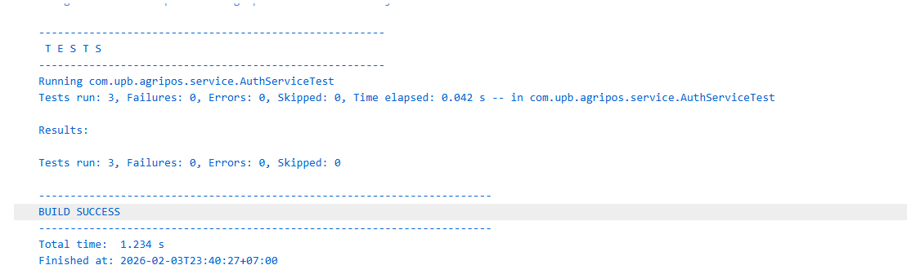
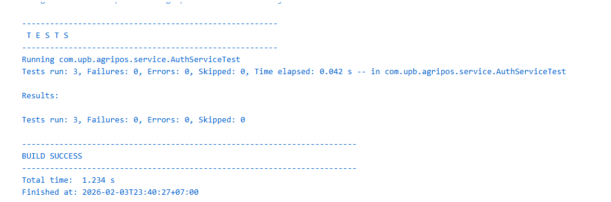
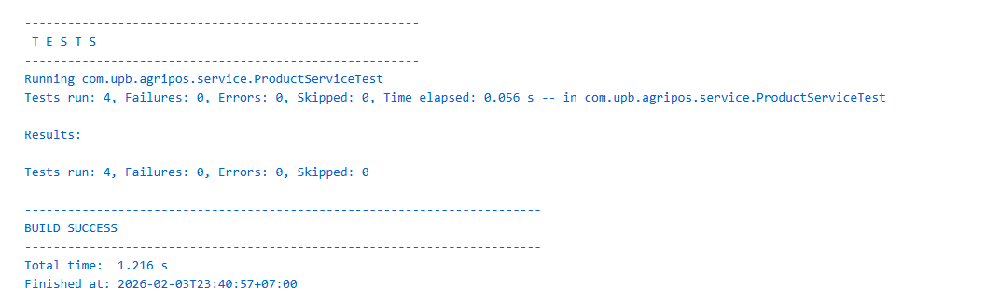
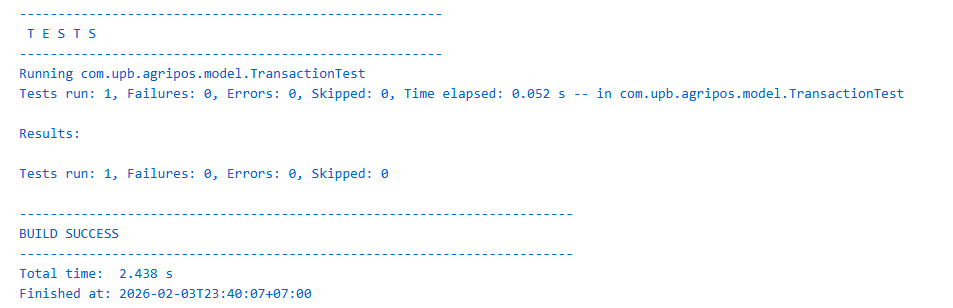

# LAPORAN PROYEK KELOMPOK TUGAS WEEK 15 
Topic : Proyek Kelompok (Desain Sistem + Implementasi Terintegrasi + Testing + Dokumentasi)

**JUDUL PROYEK:**
**AGRI-POS: SISTEM KASIR DAN MANAJEMEN TOKO PERTANIAN BERBASIS JAVA**

---

## 1. Identitas Kelompok

| Nama | NIM |
| --- | --- |
| **Ditha Elita Putri** | 240202832 |
| **Fauzatul Farhanah** | 240202834 |
| **Muhammad Nuur Fathan** | 240202840 |
| **Diva Nur Azizah** | 240202859 |
| **Hanifah** | 240202864 |

---

## 2. Ringkasan Sistem

**Agri-POS** adalah aplikasi desktop berbasis Java (JavaFX Code-based) yang dirancang untuk mendigitalisasi operasional toko pertanian. Sistem ini bertujuan mengatasi masalah pencatatan manual, kesalahan hitung stok, dan memberikan laporan penjualan yang akurat.

### 2.1 Lingkup & Batasan Masalah (*Scope & Limitations*)
Agar pengembangan tetap terfokus, proyek ini memiliki batasan sebagai berikut:
1.  **Platform:** Aplikasi berjalan secara lokal (Desktop) pada satu perangkat komputer (*Single-client*).
2.  **Mata Uang:** Hanya mendukung mata uang Rupiah (IDR).
3.  **Retur:** Sistem belum menangani fitur pengembalian barang (retur) dari pelanggan.
4.  **Hardware:** Struk belanja dihasilkan dalam format digital/teks dan belum terintegrasi langsung dengan driver printer thermal fisik secara otomatis.

### 2.2 Kebutuhan Fungsional (*Functional Requirements*)
* **FR-1 Manajemen Produk (CRUD):** Admin dapat menambah, mengubah, dan menghapus data stok barang.
* **FR-2 Transaksi Penjualan:** Kasir dapat melakukan scan/input barang, kelola keranjang, dan *checkout*.
* **FR-3 Keamanan Akses (RBAC):** Login terpisah antara Admin (Full Access) dan Kasir (Transaction Only).
* **FR-4 Metode Pembayaran:** Mendukung pembayaran Tunai dan simulasi E-Wallet.
* **FR-5 Laporan:** Pembuatan struk belanja dan rekapitulasi transaksi sederhana.

### 2.3 Kebutuhan Non-Fungsional (*Non-Functional Requirements*)
* **NFR-1 Usability:** Antarmuka pengguna dirancang minimalis (GUI) agar mudah dipahami oleh pengguna awam.
* **NFR-2 Reliability:** Perhitungan total harga dan kembalian dijamin akurat presisi desimalnya.
* **NFR-3 Security:** Password pengguna tidak disimpan dalam *plain text* (disarankan hash) dan akses menu dibatasi sesuai Role.
* **NFR-4 Data Integrity:** Menggunakan transaksi database (ACID) untuk mencegah stok minus saat pembatalan transaksi.

### 2.4 Integrasi Teknis
* **Bahasa & Framework:** Java 17+, JavaFX (Code-based UI)
* **Database:** PostgreSQL
* **Akses Data:** JDBC (Java Database Connectivity)
* **Design Pattern:** MVC, DAO, Strategy, Singleton.

---

## 3. Desain Sistem

### Arsitektur Lapisan (MVC - Model View Controller)
1.  **View** (`com.upb.agripos.view`): Antarmuka pengguna (`PosView`, `LoginView`) dibangun programatis tanpa FXML.
2.  **Controller** (`com.upb.agripos.controller`): Penghubung UI dan Logic (`PosController`).
3.  **Service** (`com.upb.agripos.service`): Logika bisnis inti (`TransactionService`, `ProductService`).
4.  **DAO** (`com.upb.agripos.dao`): Akses data (`JdbcProductDAO`, `JdbcTransactionDAO`).
5.  **Model** (`com.upb.agripos.model`): Representasi objek data (`Product`, `Transaction`).

### Keputusan Desain (*Design Decisions*)
* **DAO Pattern:** Memisahkan query SQL dari logika Java agar kode bersih.
* **Singleton Pattern:** Efisiensi koneksi database via `DatabaseConnection`.
* **Strategy Pattern:** Fleksibilitas metode bayar (`PaymentMethod`).
* **ACID Transactions:** `connection.setAutoCommit(false)` untuk integritas data transaksi.

---

## 4. UML & Diagram

### 1. Use Case Diagram
Diagram interaksi Aktor (Admin, Kasir) dengan fitur sistem.


### 2. Class Diagram
Struktur kode dan relasi antar kelas (`Entity`, `Service`, `DAO`, `Controller`).


### 3. Sequence Diagram
**A. Alur Transaksi (Kasir)**


**B. Alur Manajemen Produk (Admin)**


### 4. Entity Relationship Diagram (ERD)


---

## 5. Database Design

Sistem menggunakan **PostgreSQL**. Berikut adalah skema dan contoh data (*seed*).

### 5.1 Skema SQL (DDL)
```sql
-- Tabel Users
CREATE TABLE users (
    id SERIAL PRIMARY KEY,
    username VARCHAR(50) UNIQUE NOT NULL,
    password VARCHAR(255) NOT NULL,
    name VARCHAR(100) NOT NULL,
    role VARCHAR(20) NOT NULL CHECK (role IN ('ADMIN', 'CASHIER'))
);

-- Tabel Products
CREATE TABLE products (
    code VARCHAR(50) PRIMARY KEY,
    name VARCHAR(100) NOT NULL,
    category VARCHAR(50) DEFAULT 'Umum',
    price DECIMAL(12, 2) NOT NULL CHECK (price >= 0),
    stock INT NOT NULL CHECK (stock >= 0)
);

-- Tabel Transactions
CREATE TABLE transactions (
    id VARCHAR(50) PRIMARY KEY,
    transaction_date TIMESTAMP DEFAULT CURRENT_TIMESTAMP,
    cashier_id INT NOT NULL REFERENCES users(id),
    total_amount DECIMAL(12, 2) NOT NULL
);

-- Tabel Transaction Items
CREATE TABLE transaction_items (
    id SERIAL PRIMARY KEY,
    transaction_id VARCHAR(50) REFERENCES transactions(id),
    product_code VARCHAR(50) REFERENCES products(code),
    quantity INT NOT NULL,
    subtotal DECIMAL(12, 2) NOT NULL
);
```
## 6. Testing

### 6.1 Unit Tests

* **Lokasi:** `src/test/java/com/upb/agripos`
* **Cakupan:**
`TransactionTest``AuthServiceTest``CartServiceTest``ProductServiceTest`


* **Hasil:**

	

### 6.2 Manual Test Cases (Black Box)

| No | Skenario Pengujian | Pre-Condition | Langkah-Langkah | Hasil yang Diharapkan | Status |
| --- | --- | --- | --- | --- | --- |
| 1 | **Login Admin** | Aplikasi terbuka di halaman Login | Input user `admin` & pass `admin123` -> Klik Login | Masuk ke Dashboard Admin | **OK** |
| 2 | **Login Kasir** | Aplikasi terbuka di halaman Login | Input user `kasir1` & pass `kasir123` -> Klik Login | Masuk ke Dashboard Transaksi | **OK** |
| 3 | **Tambah Produk** | Login sebagai Admin | Input Kode `P00X`, Nama, Stok -> Klik Simpan | Data muncul di tabel & DB | **OK** |
| 4 | **Validasi Stok** | Login sebagai Kasir, Stok Produk A = 10 | Input pembelian Produk A sejumlah 15 pcs | Muncul Alert Error: "Stok tidak cukup" | **OK** |
| 5 | **Transaksi Sukses** | Keranjang terisi item | Klik Checkout -> Pilih Tunai -> Bayar | Transaksi tersimpan, Stok berkurang, Struk tampil | **OK** |
| 6 | **Hapus Produk Terjual** | Produk X pernah terjual | Admin menghapus Produk X | Sistem menghapus data tanpa error FK | **OK** |

---

## 7. Traceability Matrix

| FR ID | Fitur | Modul Kode (Implementasi) | Tabel Database |
| --- | --- | --- | --- |
| **FR-1** | Manajemen Produk | `ProductService`, `JdbcProductDAO`, `PosView` | `products` |
| **FR-2** | Transaksi & Cart | `TransactionService`, `CartService`, `PosView` | `transactions`, `items` |
| **FR-3** | Login & Auth | `AuthService`, `JdbcUserDAO`, `LoginView` | `users` |
| **FR-4** | Pembayaran | `PaymentMethod`, `CashPayment` | - |
| **FR-5** | Laporan | `ReportService`, `Receipt` | `transactions` |

---

## 8. Kontribusi Anggota

| Nama | NIM | Peran Utama |
| --- | --- | --- |
| **Ditha Elita Putri** | 240202832 | UI Designer & Frontend (JavaFX View) |
| **Fauzatul Farhanah** | 240202834 | Backend Authentication & Security |
| **Muhammad Nuur Fathan** | 240202840 | Backend Transaction Logic & Cart Service |
| **Diva Nur Azizah** | 240202859 | Database Specialist & Product Management (CRUD) |
| **Hanifah** | 240202864 | Reporting, Payment Strategy & QA |

---

## 9. Kendala & Solusi

1. **Kendala:** Error *Foreign Key Constraint* saat hapus produk terjual.
* **Solusi:** `JdbcProductDAO` dimodifikasi dengan Transaksi Database untuk hapus riwayat item dulu, baru produk masternya.


2. **Kendala:** Integrasi JavaFX dengan JDK modern (Module system).
* **Solusi:** Membuat kelas `Launcher.java` untuk bypass pengecekan module saat runtime.


3. **Kendala:** Kompleksitas FXML.
* **Solusi:** Migrasi ke **JavaFX Code-based** untuk kontrol dinamis yang lebih baik.

---

## 10. Lampiran

* **Source Code:** https://github.com/Mhmmdfthn/oop-202501-240202840/tree/main/praktikum/week15-proyek-kelompok
* **File SQL:** `sql/database schema.sql`
* **Desain Interface:** 

1. **Login**
---

---
2. **Kasir**
---
3. **Report Admin**
---
4. **Manajemen Produk**
---
* **Demo:** https://youtu.be/GWICs4Wg0VE
