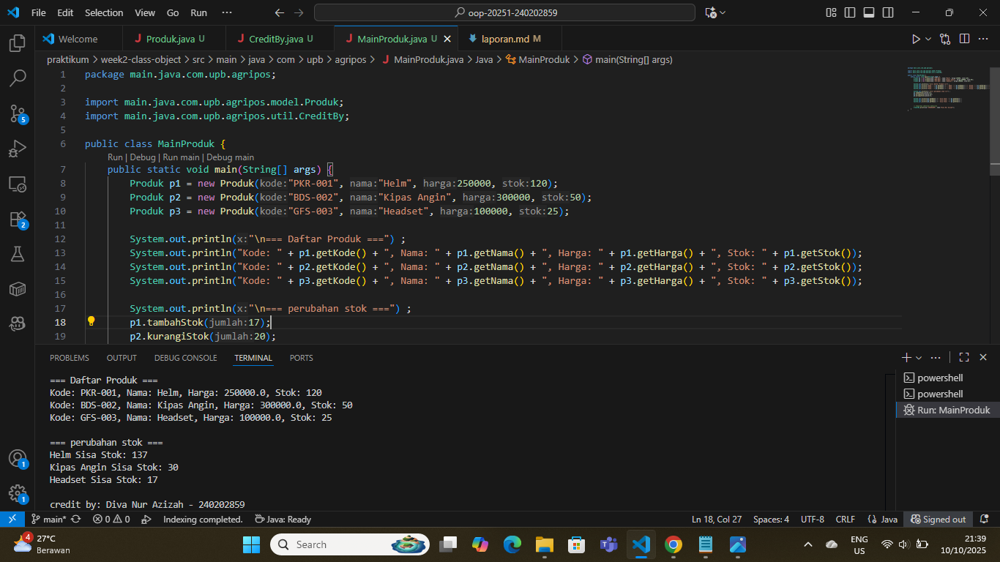

# Laporan Praktikum Minggu 2
Topik: Class dan Object

## Identitas
- Nama  : [Diva Nur Azizah]
- NIM   : [240202859]
- Kelas : [3IKRA]

---

## Tujuan  
-Mahasiswa mampu menjelaskan konsep class, object, atribut, dan method dalam OOP.
-Mahasiswa mampu menerapkan access modifier dan enkapsulasi dalam pembuatan class.
-Mahasiswa mampu mengimplementasikan class Produk pertanian dengan atribut dan method yang sesuai.
-Mahasiswa mampu mendemonstrasikan instansiasi object serta menampilkan data produk pertanian di console.
-Mahasiswa mampu menyusun laporan praktikum dengan bukti kode, hasil eksekusi, dan analisis sederhana.

---

## Dasar Teori
1. Class adalah blueprint atau cetak biru untuk membuat objek.
2. Object adalah hasil instansiasi dari sebuah class yang memiliki data (atribut) dan perilaku (method).
3. Enkapsulasi adalah penyembunyian data agar hanya dapat diakses melalui method tertentu (getter dan setter).
4. Method Getter dan Setter digunakan untuk mengambil dan mengubah nilai atribut private.
5. Konstruktor digunakan untuk memberikan nilai awal kepada atribut saat objek dibuat

---

## Langkah Praktikum
1.  **Membuat Class Produk**
   - Buat file `Produk.java` pada package `model`.
   - Tambahkan atribut: `kode`, `nama`, `harga`, dan `stok`.
   - Gunakan enkapsulasi dengan menjadikan atribut bersifat private dan membuat getter serta setter untuk masing-masing atribut.  
2.  **Membuat Class CreditBy**
   - Buat file `CreditBy.java` pada package `util`.
   - Isi class dengan method statis untuk menampilkan identitas mahasiswa di akhir output: `credit by: <NIM> - <Nama>`.
3. **Membuat Objek Produk dan Menampilkan Credit**
   - Buat file `MainProduk.java`.
   - Instansiasi minimal tiga objek produk, misalnya "Benih Padi", "Pupuk Urea", dan satu produk alat pertanian.
   - Tampilkan informasi produk melalui method getter.  
   - Panggil `CreditBy.print("<NIM>", "<Nama>")` di akhir `main` untuk menampilkan identitas.
4. **Commit dan Push**
   - Commit dengan pesan: `week2-class-object`. 

---

## Kode Program  

### 1. Produk.java
```java
package main.java.com.upb.agripos.model;
// Produk.java

public class Produk {
    private String kode;
    private String nama;
    private double harga;
    private int stok;

    public Produk(String kode, String nama, double harga, int stok) {
        this.kode = kode;
        this.nama = nama;
        this.harga = harga;
        this.stok = stok;
    }

    public String getKode() { return kode; }
    public void setKode(String kode) { this.kode = kode; }

    public String getNama() { return nama; }
    public void setNama(String nama) { this.nama = nama; }

    public double getHarga() { return harga; }
    public void setHarga(double harga) { this.harga = harga; }

    public int getStok() { return stok; }
    public void setStok(int stok) { this.stok = stok; }

    public void tambahStok(int jumlah) {
        if (jumlah > 0) {
            this.stok += jumlah;
        } else {
            System.out.println("Jumlah stok yang ditambahkan tidak boleh ditambahkan!");
            
        }
    }

    public void kurangiStok(int jumlah) {
        if (this.stok >= jumlah) {
            this.stok -= jumlah;
        } else {
            System.out.println("Stok tidak mencukupi!");
        }
    }
}
```

### 2. CreditBy.java
```java
package main.java.com.upb.agripos.util;

public class CreditBy {
    public static void print(String nim, String nama) {
        System.out.println("\ncredit by: " + nama + " - " + nim);
    }
}
```

### 3. MainProduk.java
```java
package main.java.com.upb.agripos;

import main.java.com.upb.agripos.model.Produk;
import main.java.com.upb.agripos.util.CreditBy;

public class MainProduk {
    public static void main(String[] args) {
        Produk p1 = new Produk("BNH-001", "Benih Padi IR64", 25000, 100);
        Produk p2 = new Produk("PPK-101", "Pupuk Urea 50kg", 350000, 40);
        Produk p3 = new Produk("ALT-501", "Cangkul Baja", 90000, 15);

        System.out.println("\n=== Daftar Produk ===") ;
        System.out.println("Kode: " + p1.getKode() + ", Nama: " + p1.getNama() + ", Harga: " + p1.getHarga() + ", Stok: " + p1.getStok());
        System.out.println("Kode: " + p2.getKode() + ", Nama: " + p2.getNama() + ", Harga: " + p2.getHarga() + ", Stok: " + p2.getStok());
        System.out.println("Kode: " + p3.getKode() + ", Nama: " + p3.getNama() + ", Harga: " + p3.getHarga() + ", Stok: " + p3.getStok());
        
        System.out.println("\n=== perubahan stok ===") ;
        p1.tambahStok(17);
        p2.kurangiStok(20);
        p3.kurangiStok(8);

        System.out.println(p1.getNama() + " Sisa Stok: " + p1.getStok()) ;
        System.out.println(p2.getNama() + " Sisa Stok: " + p2.getStok()) ;
        System.out.println(p3.getNama() + " Sisa Stok: " + p3.getStok()) ;


        // Tampilkan identitas mahasiswa
        CreditBy.print("240202859", "Diva Nur Azizah");
    }
}
```

---

## Hasil Eksekusi

---

## Analisis
- Kode Produk.java menerapkan enkapsulasi dengan menyembunyikan atribut (private) dan mengaksesnya melalui getter dan setter.
Objek p1, p2, dan p3 dibuat dari class Produk, masing-masing mewakili satu produk berbeda.
- Method tambahStok() dan kurangiStok() digunakan untuk memperbarui jumlah stok sesuai aktivitas barang masuk atau keluar.
- Saat proses pengerjaan, sempat terjadi error pada package karena penulisan struktur package tidak sesuai dengan letak file. Setelah disesuaikan dengan folder proyek, program dapat berjalan dengan baik dan menampilkan hasil sesuai logika perubahan stok.
---

## Kesimpulan
Program Produk.java menerapkan konsep enkapsulasi dengan atribut private serta penggunaan getter dan setter untuk mengatur data. Dengan class dan object, program menjadi lebih terstruktur dan mudah dikembangkan. Setelah memperbaiki error pada package, program berjalan dengan baik. Mahasiswa juga telah memahami dasar pembuatan class, objek, dan method dalam Java.

---

## Quiz
1. Mengapa atribut sebaiknya dideklarasikan sebagai private dalam class?
   **Jawaban:** Atribut sebaiknya dideklarasikan sebagai private untuk menerapkan enkapsulasi, yaitu melindungi data agar tidak dapat diakses atau diubah langsung dari luar class. Dengan begitu, data menjadi lebih aman dan hanya bisa diubah melalui method tertentu (getter dan setter) yang sudah dikontrol.
  

2. Apa fungsi getter dan setter dalam enkapsulasi?
   **Jawaban:** Getter dan setter berfungsi untuk mengakses dan mengubah nilai atribut private dengan cara yang aman dan terkontrol.
*Getter digunakan untuk mengambil (membaca) nilai atribut.
*Setter digunakan untuk mengubah (menulis) nilai atribut dengan validasi tertentu bila diperlukan.


3. Bagaimana cara class Produk mendukung pengembangan aplikasi POS yang lebih kompleks?
   **Jawaban:**  Class Produk menjadi pondasi data utama dalam aplikasi POS (Point of Sale). Dengan mendefinisikan atribut seperti kode, nama, harga, dan stok serta menggunakan enkapsulasi, class ini:
*Memudahkan pengelolaan data produk secara terstruktur.
*Dapat diperluas untuk fitur lain seperti diskon, kategori, atau laporan penjualan.
*Memungkinkan integrasi dengan class lain (misalnya Transaksi atau Customer) untuk membangun sistem POS yang lebih kompleks dan modular.
