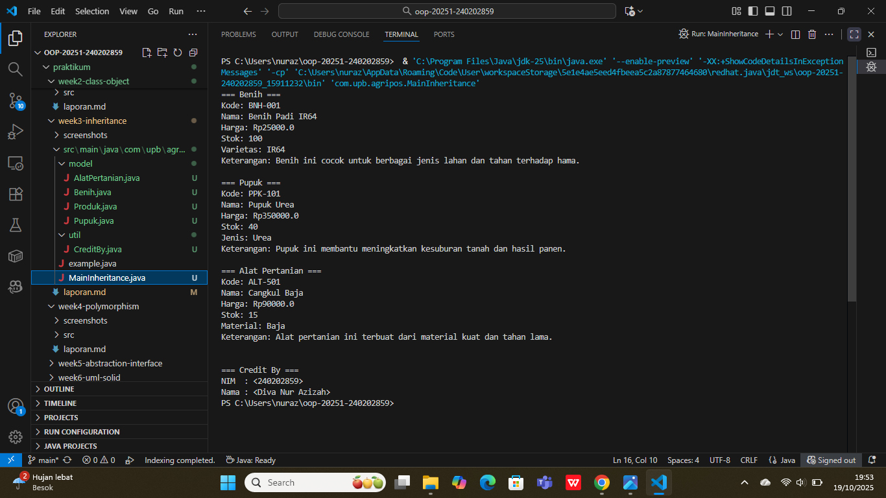

# Laporan Praktikum Minggu 3
Topik: Bab 3 – Inheritance (Kategori Produk)


## Identitas
- Nama  : [Diva Nur Azizah]
- NIM   : [240202859]
- Kelas : [3IKRA]

---

## Tujuan
- Mahasiswa mampu menjelaskan konsep inheritance (pewarisan class) dalam OOP.
- Mahasiswa mampu membuat superclass dan subclass untuk produk pertanian.
- Mahasiswa mampu mendemonstrasikan hierarki class melalui contoh kode.
- Mahasiswa mampu menggunakan super untuk memanggil konstruktor dan method parent class.
- Mahasiswa mampu membuat laporan praktikum yang menjelaskan perbedaan penggunaan inheritance dibanding class tunggal.

---

## Dasar Teori
Inheritance adalah mekanisme dalam OOP yang memungkinkan suatu class mewarisi atribut dan method dari class lain.
   - Superclass: class induk yang mendefinisikan atribut umum.
   - Subclass: class turunan yang mewarisi atribut/method superclass, dan dapat menambahkan atribut/method baru.
   - super digunakan untuk memanggil konstruktor atau method superclass.
Dalam konteks Agri-POS, kita dapat membuat class Produk sebagai superclass, kemudian Benih, Pupuk, dan AlatPertanian sebagai subclass. Hal ini membuat kode lebih reusable dan terstruktur.

---

## Langkah Praktikum
1. **Membuat Superclass Produk**  
   - Gunakan class `Produk` dari Bab 2 sebagai superclass.

2. **Membuat Subclass**  
   - `Benih.java` → atribut tambahan: varietas.  
   - `Pupuk.java` → atribut tambahan: jenis pupuk (Urea, NPK, dll).  
   - `AlatPertanian.java` → atribut tambahan: material (baja, kayu, plastik). 

3. **Membuat Main Class**  
   - Instansiasi minimal satu objek dari tiap subclass.  
   - Tampilkan data produk dengan memanfaatkan inheritance. 

4. **Menambahkan CreditBy**  
   - Panggil class `CreditBy` untuk menampilkan identitas mahasiswa. 

5. **Commit dan Push**  
   - Commit dengan pesan: `week3-inheritance`.

---

## Kode Program 

### 1. Produk.java
```java
package com.upb.agripos.model;
// Produk.java

public class Produk {
    private String kode;
    private String nama;
    private double harga;
    private int stok;

    public Produk(String kode, String nama, double harga, int stok) {
        this.kode = kode;
        this.nama = nama;
        this.harga = harga;
        this.stok = stok;
    }

    public String getKode() { return kode; }
    public String getNama() { return nama; }
    public double getHarga() { return harga; }
    public int getStok() { return stok; }

    public void setKode(String kode) { this.kode = kode; }
    public void setNama(String nama) { this.nama = nama; }
    public void setHarga(double harga) { this.harga = harga; }
    public void setStok(int stok) { this.stok = stok; }

    public void tampilInfo() {
        System.out.println("Kode: " + kode);
        System.out.println("Nama: " + nama);
        System.out.println("Harga: Rp" + harga);
        System.out.println("Stok: " + stok);
    }
}
```

### 2. Benih.java
```java
package com.upb.agripos.model;

public class Benih extends Produk {
    private String varietas;

    public Benih(String kode, String nama, double harga, int stok, String varietas) {
        super(kode, nama, harga, stok);
        this.varietas = varietas;
    }

    public String getVarietas() { return varietas; }
    public void setVarietas(String varietas) { this.varietas = varietas; }

        public void deskripsi() {
        System.out.println("=== Benih ===");
        tampilInfo();
        System.out.println("Varietas: " + varietas);
        System.out.println("Keterangan: Benih ini cocok untuk berbagai jenis lahan dan tahan terhadap hama.");
    }
}
```

### 3. Pupuk.java
```java
 package com.upb.agripos.model;

public class Pupuk extends Produk {
    private String jenis;

    public Pupuk(String kode, String nama, double harga, int stok, String jenis) {
        super(kode, nama, harga, stok);
        this.jenis = jenis;
    }

    public String getJenis() { return jenis; }
    public void setJenis(String jenis) { this.jenis = jenis; }

    public void deskripsi() {
        System.out.println("=== Pupuk ===");
        tampilInfo();
        System.out.println("Jenis: " + jenis);
        System.out.println("Keterangan: Pupuk ini membantu meningkatkan kesuburan tanah dan hasil panen.");
    }
}
```

### 4. AlatPertanian.java
```java
package com.upb.agripos.model;

public class AlatPertanian extends Produk {
    private String material;

    public AlatPertanian(String kode, String nama, double harga, int stok, String material) {
        super(kode, nama, harga, stok);
        this.material = material;
    }

    public String getMaterial() { return material; }
    public void setMaterial(String material) { this.material = material; }

        public void deskripsi() {
        System.out.println("=== Alat Pertanian ===");
        tampilInfo();
        System.out.println("Material: " + material);
        System.out.println("Keterangan: Alat pertanian ini terbuat dari material kuat dan tahan lama.");
    }
}
```

### 5. CreditBy.java
```java
package com.upb.agripos.util;

public class CreditBy {
    public static void print(String nim, String nama) {
        System.out.println("\n=== Credit By ===");
        System.out.println("NIM  : " + nim);
        System.out.println("Nama : " + nama);
    }
}
```

## 6. MainInheritance.java
```java
package com.upb.agripos;

import com.upb.agripos.model.*;
import com.upb.agripos.util.CreditBy;

public class MainInheritance {
    public static void main(String[] args) {
        Benih b = new Benih("BNH-001", "Benih Padi IR64", 25000, 100, "IR64");
        Pupuk p = new Pupuk("PPK-101", "Pupuk Urea", 350000, 40, "Urea");
        AlatPertanian a = new AlatPertanian("ALT-501", "Cangkul Baja", 90000, 15, "Baja");

        b.deskripsi();
        System.out.println();
        p.deskripsi();
        System.out.println();
        a.deskripsi();
        System.out.println();

        CreditBy.print("<240202859>", "<Diva Nur Azizah>");
    }
}
---

## Hasil Eksekusi

---

## Analisis
- Pada proses pengerjaan tugas minggu ini, saya menerapkan konsep inheritance (pewarisan) di Java untuk menghubungkan class Produk sebagai superclass dengan subclass Benih, Pupuk, dan AlatPertanian.
- Awalnya saya mengalami kendala pada struktur package, karena folder belum sesuai urutan src/main/java/com/upb/agripos/..., sehingga file tidak dikenali sistem.
   - Solusi: menyesuaikan struktur folder agar sesuai dengan package pada baris package com.upb.agripos.model; dan package com.upb.agripos.util;. Setelah disusun benar, error hilang dan program bisa dijalankan.
- Dibuat class Produk sebagai superclass yang berisi atribut umum (kode, nama, harga, stok).
- Dibuat tiga subclass yaitu:
    - Benih → menambahkan atribut varietas
    - Pupuk → menambahkan atribut jenis
    - AlatPertanian → menambahkan atribut material
- Setiap subclass memiliki method deskripsi() untuk menampilkan detail produknya masing-masing. 
- Pada class MainInheritance, objek dari setiap subclass dipanggil dan dipisahkan dengan System.out.println(); agar output antar produk tidak menempel.
- Ditambahkan juga class CreditBy di package util untuk menampilkan identitas pembuat program.
- Perbedaan pendekatan minggu ini dibanding minggu sebelumnya yaitu minggu sebelumnya menggunakan class tunggal tanpa inheritance, semua atribut ditulis berulang di setiap class. Sedangkan minggu ini menggunakan pewarisan (inheritance) sehingga kode menjadi lebih efisien, rapi, dan mudah dikembangkan. 

---

## Kesimpulan
Dari praktikum minggu ini dapat disimpulkan bahwa penggunaan inheritance membuat program lebih terstruktur, efisien, dan mudah dikembangkan.
Superclass Produk mampu menampung atribut serta method umum yang kemudian diwariskan ke subclass (Benih, Pupuk, AlatPertanian).
Dengan cara ini, duplikasi kode dapat dihindari, dan setiap subclass hanya fokus pada atribut atau perilaku khusus miliknya.
Selain itu, penataan package yang benar sangat penting agar program dapat dijalankan tanpa error.

---

## Quiz
1. [Apa keuntungan menggunakan inheritance dibanding membuat class terpisah tanpa hubungan?]  
   **Jawaban:** Keuntungan menggunakan inheritance adalah kode menjadi lebih efisien dan terstruktur, karena atribut dan method umum cukup ditulis satu kali di superclass. Semua subclass bisa langsung mewarisi tanpa perlu menulis ulang. Hal ini juga memudahkan perawatan program — jika ada perubahan pada bagian umum, cukup diubah di superclass saja dan otomatis berlaku di semua subclass. 

2. [Bagaimana cara subclass memanggil konstruktor superclass? ]  
   **Jawaban:** Subclass memanggil konstruktor superclass dengan menggunakan kata kunci super() di dalam konstruktor milik subclass.
Contoh:
public Benih(String kode, String nama, double harga, int stok, String varietas) {
        super(kode, nama, harga, stok);
        this.varietas = varietas;

File lain seperti Pupuk.java dan AlatPertanian.java juga punya bagian serupa, tujuannya agar subclass bisa mewarisi dan menginisialisasi atribut dari superclass Produk.

3. [Berikan contoh kasus di POS pertanian selain Benih, Pupuk, dan Alat Pertanian yang bisa dijadikan subclass.  ]  
   **Jawaban:** Contoh lain yang bisa dijadikan subclass adalah:
    - Pestisida → memiliki atribut khusus seperti jenisHama dan kandunganBahanAktif.
    - ObatTanaman → atribut tambahan fungsi dan tanggalKedaluwarsa.
    - BibitBuah → atribut jenisBuah dan lamaPanen.
Semua contoh tersebut masih berhubungan dengan Produk Pertanian dan dapat mewarisi atribut dasar dari Produk.

